# DIGITAL ELECTRONICS 1
**2021**, Faculty of Electrical Engineering and Communication [FEKT](https://www.fekt.vut.cz/)   
  
**Title:** Project 2021  
**Topic:** 3. Console for bike with hall sensor, measuring and displaying speed, traveled distance and burnt calories  
**Time Window:** 
   - *Start of Project*: *April 7*
   - *End of Project*:   *May 4*  

**Supervisor:** **_doc. Ing. Tomáš Frýza, Ph.D._**  
**Vivado Teachers:** **_doc. Ing. Tomáš Frýza, Ph.D._**, **_Ing. Stanislav Rozum_**

# 3. Console for bike with hall sensor, measuring and displaying speed, traveled distance and burnt calories

### Team members

- **Martin Kousal**, **ID=** *221063*   
[Link to GitHub project folder]( http://github.com/mkousal/Digital-electronics-1-Tachometer)   
- **Matej Ledvina**, **ID=** *221339*   
[Link to GitHub]( https://github.com/Ledvuk/Digital-electronics-1)   
- **Tomáš Kříčka**, **ID=**  *223283*   
[Link to GitHub]( https://github.com/TomasKricka)   
- **Samuel Košík**, **ID=** *221056*  
[Link to GitHub project folder]( https://github.com/amwellius/Digital-electronics-1/tree/main/Labs/project)

### Project objectives

Our application uses two hall sensors for measuring speed, traveled distance, burnt calories and time (not by the hall sensor).  
This data is shown on four 7segment displays (one part).
  - Calories counting
  - Total time
  - Total distance traveled
  - Trip distance traveled
  - Speed measuring  

Modes can be selected by pressing buttons (see below).  
One hall sensor is used for measuring speed and traveled distance. Another one is for calories counting.  
Burnt calories will increase only by stepping the pedals, not by downhill riding!

## Hardware description

   ### Programming Board
   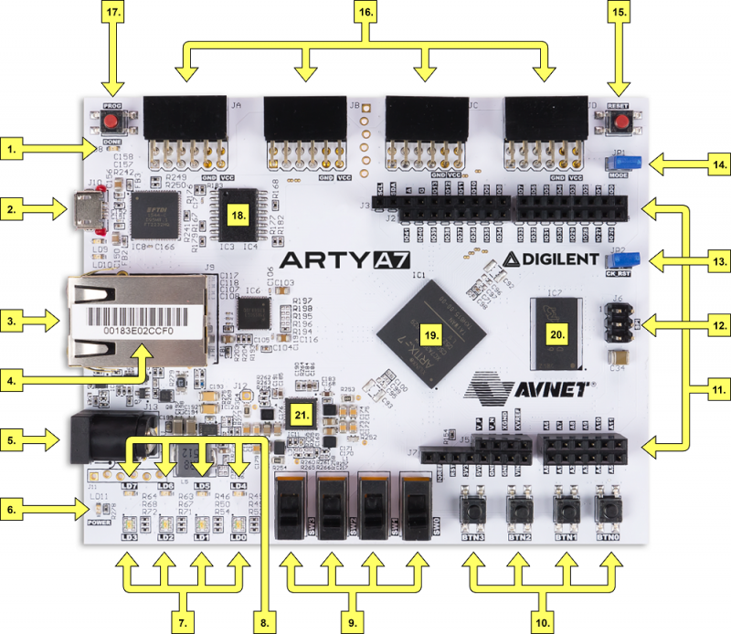
   - Main programming board is **Arty A7-100T**. It has four Pmod connectors (16.), we have used all of them
   - Other buttons and LEDs are not used => See **Main Board**

   ### Main Board
   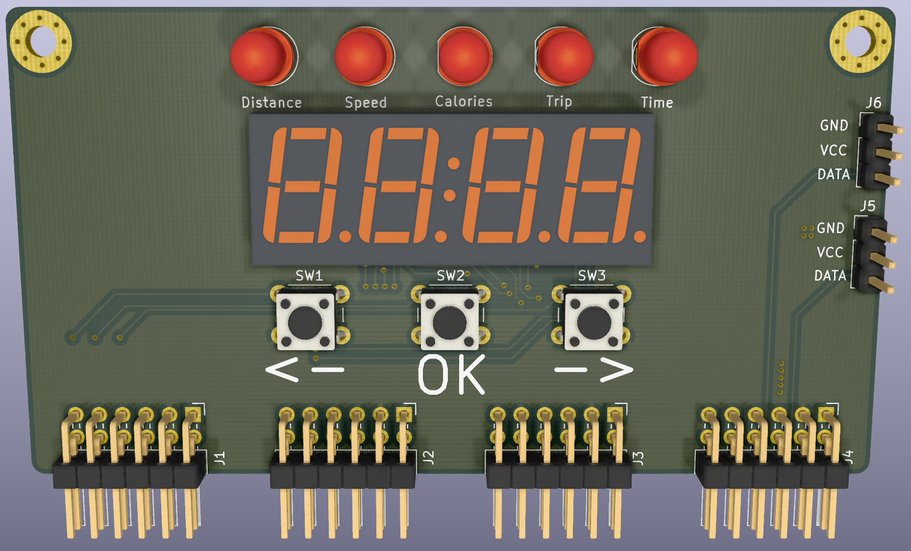
   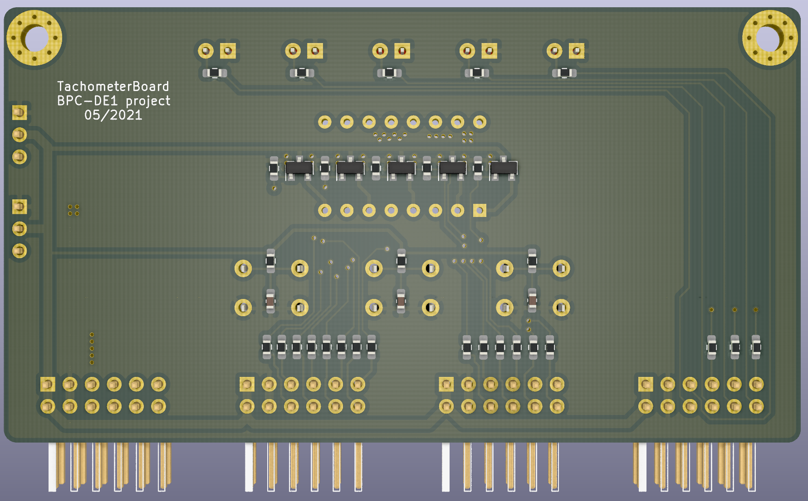
   - [Schematic](files/tachometerBoard_schematic.pdf)
   - **Consists of:** three buttons, 7segment display, Pmod connectors, LED status and two connectors for Hall sensors
   - Board is made for direct connection to Arty A7 board. Three buttons are used to controlling the tachometer. LED at the top shows what value is now displayed at the display
   - Used seven segment display with middle double dot and dots for decimal is TDCG1050m - [datasheet](https://www.vishay.com/docs/83180/tdcx10x0m.pdf)

   ### Hall sensor board
   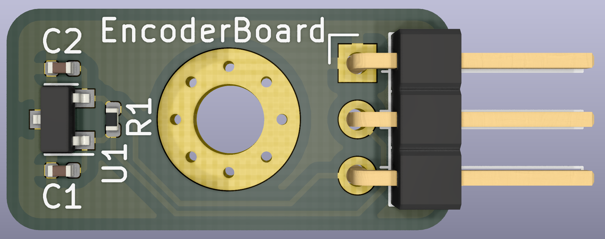  
   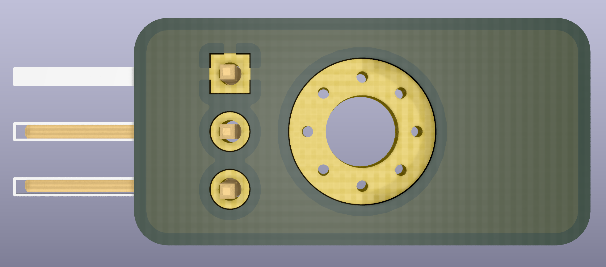
   - [Schematic](files/encoderBoard_schematic.pdf)
   - Hall sensor board only consists of hall sensor and a few passive components that are described in datasheet and connector
   - You can screw it by using M3 screw to your bicycle
   - Used sensor is *MH253* - [datasheet](https://datasheet.lcsc.com/szlcsc/1811141821_MST-Magnesensor-Tech-MST-MH253ESO_C114369.pdf)

## VHDL modules description

### Buttons
#### `Button_int`:
   - This block reads the input from real world buttons and translates them to commands which will be sent to the state_machine controller. When buttons *up* or *down* are            pressed, the interface will enter a cooldown state when no additional button presses will be registered (to prevent jitter) after the cooldown passes, the interface will        send an *up* or *down* command out
   - If the *ok* button is pressed, the device enters the cooldown state, after which it will wait for a longer ammount of time. If no additional *ok* button press is                registered, the interface will send out an *startstop* command
   - If, however, the *ok* button would be pressed again, the interface will send out the *reset* command
### Traveled distance
#### `km_total`:
   - This block counts the travel distance and sends it out to the display. Every 100 m (meters) an pulse will appear on the `meters_i` which will add to the total count of up        to *999,9 km* 
   - When the **trip mode** is activated the block will count the trip time and send it to the display instead, the total time is being still counted in the background
   - *rst signal* will make the current displayed data reset to 0 
   - The enable signal will be present if the trip is not paused, on *pause* the trip data is not counted
   - This block automaticaly wipes previous trip data when the mode is turned on

This block also contains a **function** which converts the traveled distance from *binary integer* to *BCD code* to be displayed on the 4 digit 7 segment display.

### Main controling module
#### `state_machine`:
   - This is the main utility block of the device. It recives commands from the button interface and switches the outputs accordingly. Inputs `up_i` and `down_i` will cycle          through the 4 modes of the device and light up their status LED 
   - While in a mode the *data stream* from its block will be sent to be displayed on the segment display via the `data_o`, with added decimal point or double dot if needed 
   - While in a mode the *reset* and *ok* commands also aply for the selected block only. The *trip mode* is special, because it does not generate data on its own, when              activated, it will send a mode change command to all blocks which will now store and display data in an additional variable as well as keeping the total count going 
   - The status LED of trip will remain on as we cycle through the other modes until it is paused by the *startstop* button or turned off via the reset. At this point all trip        data will be reset from all blocks and the normal total data will be displayed

### Time mode
#### `total_time`:
   - This block acts as a stopwatch. When startstop is applied, it will *start* or *pause* the counting
   - *Reset* will reset the total time
   - When the *trip mode* is enabled, the stopwatch will automatically start counting the trip time and will reset before every trip is started 
 
 This block also contains a **function** which converts the total time from *binary integer* to *BCD code* to be displayed on the 4 digit 7 segment display.

### SENSOR  
#### `sensor`:
   - This block is used to calculate actual speed and triggering pulse every 100 meters for counting travelled distance  
   - Uses input from hall sensor mounted at the front wheel. Output one trigger signal every counted 100 meters and calculate actual real speed and set it to display output   

### 7 Segment Driver Module  
   - This block consists of 4 smaller modules: 
      1. `CLOCK`
      2. `UP_DOWN_COUNTER`
      3. `DRIVER_4X7SEG`
      4. `DECODER_7SEG`  
#### `CLOCK`:
   - Generates 100MHz clock
   - This periodic signal is used in module `UP_DOWN_COUNTER`, which reacts on rising edge of the signal  
   - Originally uses 4ms for each segment
#### `UP_DOWN_COUNTER`:
   - According settings (g_CNT_WIDTH), counts as the edge of the clock signal rises  
#### `DRIVER_4X7SEG`:
   - Main module, drives four 7segment displays. It is determinated by `CLOCK` and `UP_DOWN_COUNTER`  
   - Process MUX uses above modules to set data_outputs to each 7segment display  
   - Input is a 16bit unsigned (`b"xxxx xxxx xxxx xxxx"`)
#### `DECODER_7SEG`:
   This module is used for displaying data on 7segment display. If have more displays, MUX has to be used  
   Both, common cathode and common anode can be used as well

### Calories Mode
#### `calories`:
   - This block calculates burned calories by measuring the time between each pedals rotations 
   - Rotation is captured by hall probe attached to pedal
   - The 100 MHz clock is used for counting time. Every 0.5s a number is increased, which recalculates the calories formula 
   - When signal from hall probe is not generating for 2s, the number that was increasing is stopped. The amount of burned calories is sent to display
   
## Testbenches and simulations
#### `Button_int`:
   - Shows states of `button_int` block
   - In order to save time and make the inner working of this device more clear, all simulated data has been sped up  
   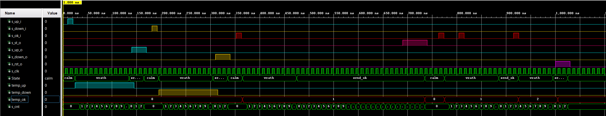

#### `km_total`:
   - Screenshot demos how the counting works
   - In order to save time and make the inner working of this device more clear, all simulated data has been sped up
   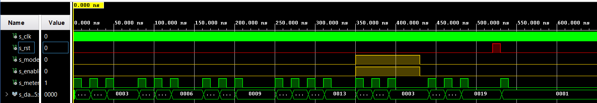
   
#### `state_machine`:
   - Screenshot below represents testbench of main unit
   - In order to save time and make the inner working of this device more clear, all simulated data has been sped up 
   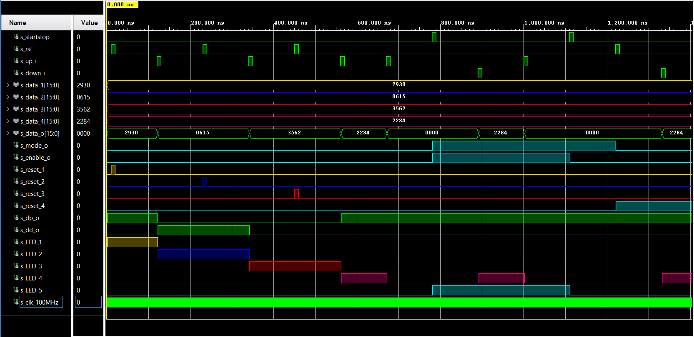 

#### `total_time`:
   - Fincionality of total time counting is shown by this signals
   - In order to save time and make the inner working of this device more clear, all simulated data has been sped up
   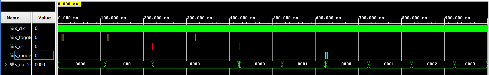 

#### `sensor`:  
   - First waveform shows how the speed calculation works. Calculated speed is written to the `s_disp_o`, which is 16bit word and is here until the new value is calculated
   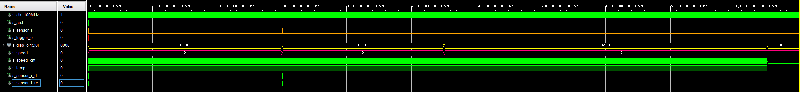
   - Second waveform shows pulsing at the `s_trigger_o` every 50 sensor's tick, which is equal to the 100 meters in real distance
   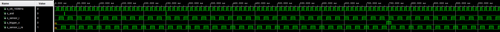

#### `CLOCK`:  
   - Generates 100 MHz clock signal
   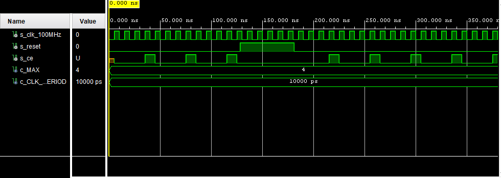
   
#### `UP_DOWN_COUNTER`:  
   - As internal values set, counts with edge of the clock
   - 0-31 states:
   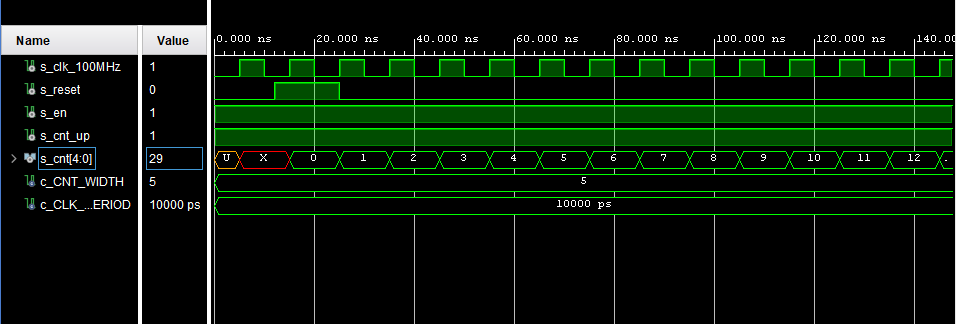
   - 0-31 states:
   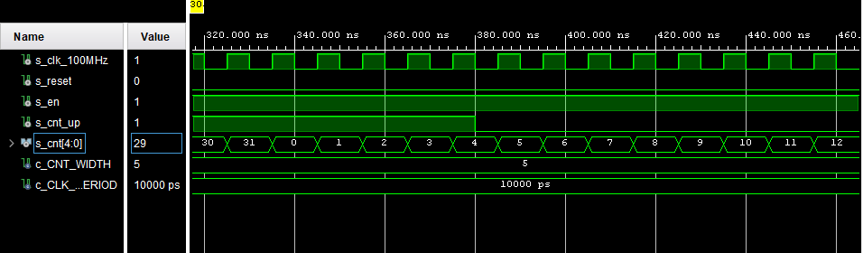
   - 0-4 states = This is used in our application
   - Four 7segment displays are controlled by this states
   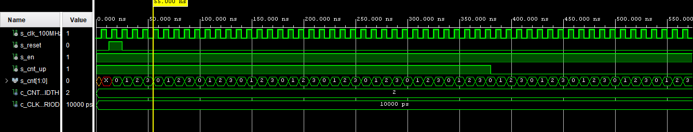
   
#### `DRIVER_4X7SEG`:
   - These screenshots show how the multiplexer works
   - `s_data` is the main 16bit data input
   - `s_hex` is the 4bit data output, which is used in `DECODER_7SEG`. This module decodes the 4bit data value and diplays it on a specific 7segment display
   - `s_dig_o` shows which one of four displays is being used. `b"0001"` means display on very right side
   - `s_seg_o` represents common cathode bits
   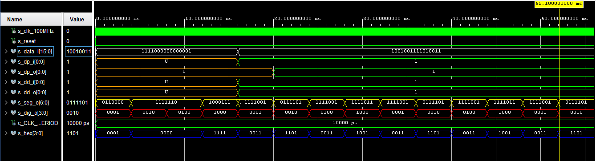
   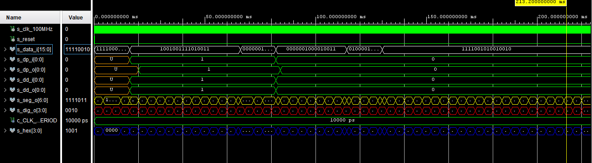   
   - This screenshot shows a real situation, when input data will be refreshed every one second (tachometer)
   - If data is not changed for a while, displays will use last data. This prevents from wrong/unwanted values
   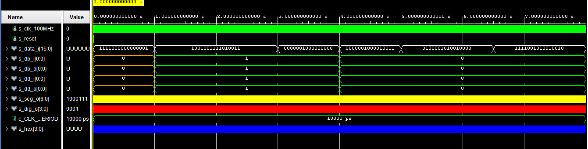
#### `DECODER_7SEG`:
   - Decodes 4bit signal to 7bit (7 segments (+ decimal dot and colon))
   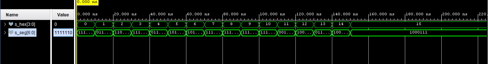

#### `calories`:
   - The simulation is in ratio 1s = 10ms
   - In wave form is display calories counting in both modes and amount of burned calories is sending to display
   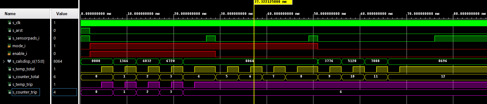

## TOP module description and simulations
   - TOP module represents the whole project
   - Final test schema can be seen below:
   
   - After having **main board** and **hall sensor board** done, software can be written into Arty A7 board. Generated bitstream is available [here](sw\tachometer\tachometer.runs\impl_1\top.bit).  
   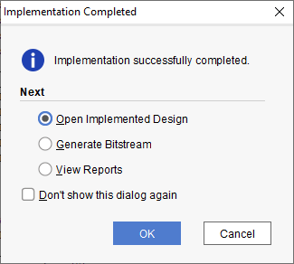

## Video

*Write your text here*

## References

   ### Used materials:
   - Theoretical knowledge from Digital-Electronics-1 Labs, 2021 > [Link]( https://github.com/tomas-fryza/Digital-electronics-1/tree/master/Labs)
   - Labs from classes **DE1** 
   - DE1 Lecture PDF > [Link]( https://moodle.vutbr.cz/pluginfile.php/331523/mod_resource/content/3/DE1_lecture_part4_CZE.pdf)
   - [7 Segment Display]( https://docs.rs-online.com/6e0e/0900766b8130126b.pdf)
   - [Hall sensor](https://datasheet.lcsc.com/szlcsc/1811141821_MST-Magnesensor-Tech-MST-MH253ESO_C114369.pdf)
 
   ### Used programs and its links:
   - [Xilinx Vivado 2020]( https://www.xilinx.com/products/design-tools/vivado.html)
   - [VSCode]( https://code.visualstudio.com/)
   - [KiCad]( https://www.kicad.org/)
   - [EdaPlayGround]( https://www.edaplayground.com/)
   - [Xilinx Vivado 2020]( https://www.xilinx.com/products/design-tools/vivado.html)
   - [Vivado tutorials]( https://vhdlwhiz.com/basic-vhdl-tutorials/ )
   - [Tutorial from Xilinx]( https://www.xilinx.com/support/documentation/university/Vivado-Teaching/HDL-Design/2013x/Nexys4/Verilog/docs-pdf/Vivado_tutorial.pdf)
   - [Board Editor]( https://jamboard.google.com/)
   - [GitHub Desktop]( https://desktop.github.com/)
   - [Git Bash]( https://git-scm.com/download/win)
   
________________________________________________________________________________
©2021, VUT FETK, Brno, Czech Republic  
Kousal Martin, Ledvina Matej, Kříčka Tomáš, Košík Samuel  
**For Educational Purposes Only!**

